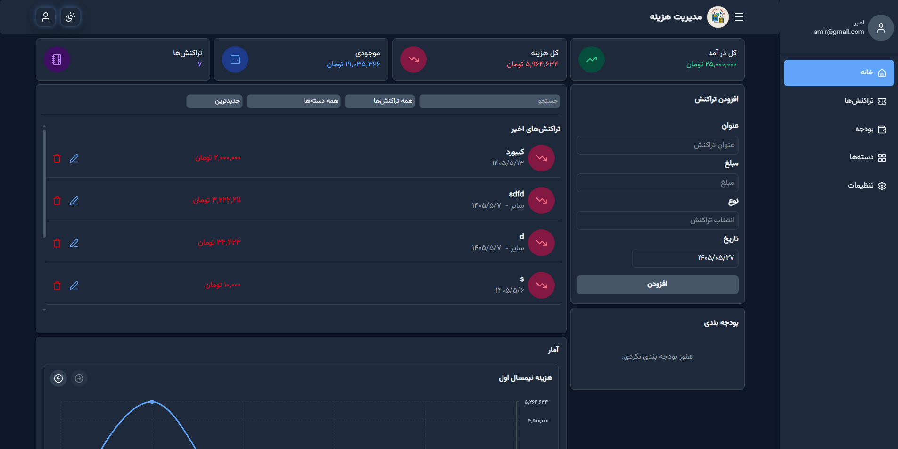

# Expense Tracker
یک پروژه تمرینی مدیریت هزینه با React برای یادگیری و تقویت مفاهیم پایه React.

## معرفی پروژه
هدف این پروژه، تمرین مفاهیم React و ساخت یک پروژه‌ی کوچک اما کاربردی در مسیر یادگیری فرانت‌اند است.

این اپلیکیشن برای مدیریت هزینه‌ها و درآمدهای شخصی طراحی شده و امکان ثبت، دسته‌بندی و مدیریت تراکنش‌های مالی را فراهم می‌کند.

این پروژه همچنان در حال توسعه است و در حال حاضر نسخه‌ی دسکتاپ آن پیاده‌سازی شده است. نسخه‌ی واکنش‌گرا (Responsive) برای موبایل در نسخه‌های آینده اضافه خواهد شد.


## قابلیت‌ها
- اضافه کردن تراکنش جدید
- تعیین دسته‌بندی برای هر تراکنش (مثلا خوراک، حمل‌ونقل، تفریح و ...)
- تعیین نوع تراکنش (هزینه یا درآمد)
- ویرایش تراکنش
- نمایش مجموع درآمد
- نمایش مجموع هزینه
- نمایش موجودی کیف پول (درآمد - هزینه)
- فیلتر کردن تراکنش‌ها براساس دسته‌بندی
- مرتب سازی تراکنش ها (جدیدترین، قدیمی ترین، بیشترین مبلغ، کمترین مبلغ)
- امکان جستجو بین تراکنش‌ها
- نمایش چارت درآمد و هزینه


## در حال توسعه
- تعیین بودجه برای هر دسته
- نسخه Responsive برای موبایل


## تکنولوژی‌ها
- 
- 
- 


## کتابخانه‌ها
- lucide-react
- react-hot-toast
- sweetalert2
- react-multi-date-picker
- react-router


## اجرای پروژه
پیش‌نیاز: Node.js نسخه 18 یا بالاتر

```bash
npm install
npm run dev
```

پس از اجرا، پروژه در آدرس لوکال نمایش داده می‌شود (معمولا):

```text
http://localhost:5173/expense-tracker-main/
```


## مشاهده پروژه
[Live Demo](https://amirahmadpoor.github.io/expense-tracker/)